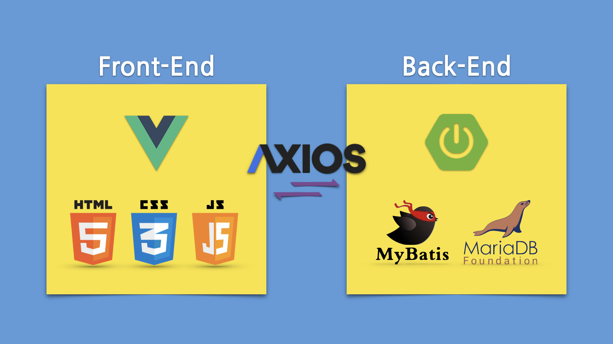

# Shell

Spring boot + Front-End Developer Folder

### 프로젝트 구조

##### Front-End > Vue3.\*

```
cd vue-app
yarn serve --port 8800 --open
```

##### Back-End > SpringBoot-3.0.5-SNAPSHOT

```
cd app
./gradlew bootRun
```

</img>

##### YouTube Link

[](https://youtu.be/povDCmh3BfM)
