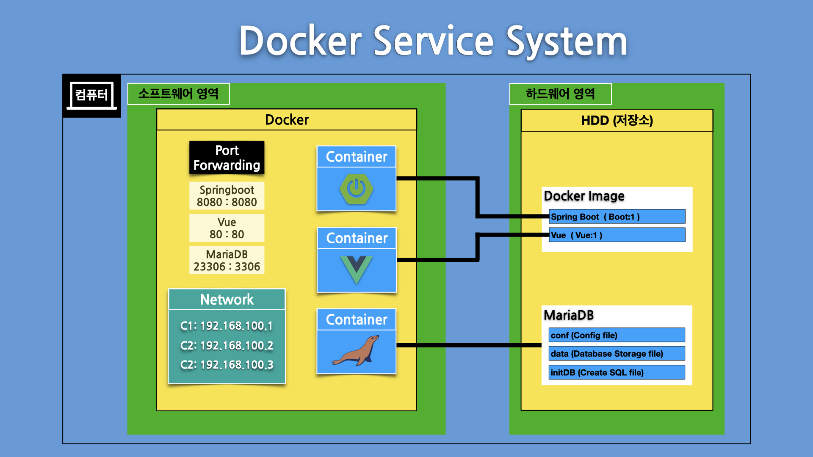

# Shell

Spring boot + Front-End Developer Folder

### 프로젝트 구조

##### Front-End > Vue3.\*

```
cd vue-app
yarn serve --port 8800 --open
```

##### Back-End > SpringBoot-3.0.5-SNAPSHOT

```
cd app
./gradlew bootRun
```

</img>

### 프로젝트 배포 Docker

</img>

##### Vue Docker File

```
FROM node:latest as builder  # Docker Image Node 사용

WORKDIR /app  # Project 파일 작업할 위치 설정
COPY package.json ./  # Project에 필요한 Module 받기 위해서 package.json 파일 먼저 복사
RUN yarn install  # Module 다운로드하여 Project 환경 설정
COPY . .  # Project 파일 전부 복사
RUN yarn run build  # Project Build 하기

FROM nginx:latest  # Docker Image NginX 사용
#COPY --from=builder /app/dist /usr/share/nginx/html  # 기본으로 사용 시 기본 위치에 복사
COPY --from=builder /app/dist /app  # nginx.conf 파일 사용시 특정 위치에 복사
COPY nginx.conf /etc/nginx/nginx.conf  # Vue의 SPA 단점으로 새로 고침시 404 에러 해결를 위한 설정파일

EXPOSE 80  # Port 80 허용하기
```

##### Spring Boot Docker File

```
FROM gradle:latest as builder  # Docker Image Gradle 사용

WORKDIR /app  # Project 파일 작업할 위치 설정
COPY . .  # Project 파일 전부 복사 하기
RUN ./gradlew bootJar  # Gradle Build 하기

FROM openjdk:latest  # Docker Image OpenJDK 사용
COPY --from=builder /app/build/libs/ /app  # Gradle Build한 파일 복사해 오기

EXPOSE 8080  # Port 8080 허용하기
ENTRYPOINT [ "java", "-jar", "-Dspring.profiles.active=prod", "/app/app.jar" ]
# Docker Run 될때 무조건 실행되는 명령어 (Project 실행)
```

##### Docker Compose

```
docker-compose up -d
```

##### Docker Network

```
docker network ls
docker network inspect boot_vue_myNet
```

### YouTube Link

###### 1. 프로젝트 만들기

[](https://youtu.be/povDCmh3BfM)

###### 2. Vue화면 설정하기 (Router)

[](https://youtu.be/PACW_Wmafns)

###### 3. Axios 사용하기 [CROS Policy]

[](https://youtu.be/veDJeJe5Xck)

###### 4. SpringBoot 기능 구현하기 1부 [MVC패턴]

[](https://youtu.be/_OzpyzFd1d0)

###### 5. SpringBoot 기능 구현하기 2부 [MVC패턴]

[](https://youtu.be/-FSmrUACdpo)

###### 6. Vue 이벤트 1부 [ListView Event]

[](https://youtu.be/0EA3vWoszyM)

###### 7. Vue 이벤트 2부 [Vuex Store]

[](https://youtu.be/im-fzWGZilo)

###### 8. Vue 이벤트 3부 [Update & Delete Event]

[](https://youtu.be/LvDZMY0rwXk)

###### 9. Vue 이벤트 4부 [User Create]

[](https://youtu.be/glk_V6zJI0o)

###### 10. Vue 이벤트 5부 [Session Storage]

[](https://youtu.be/9XCN-ugG0EI)

###### 11. 프로젝트 배포 [Docker Compose Build]

[](https://youtu.be/cMmk1Gltwkw)
