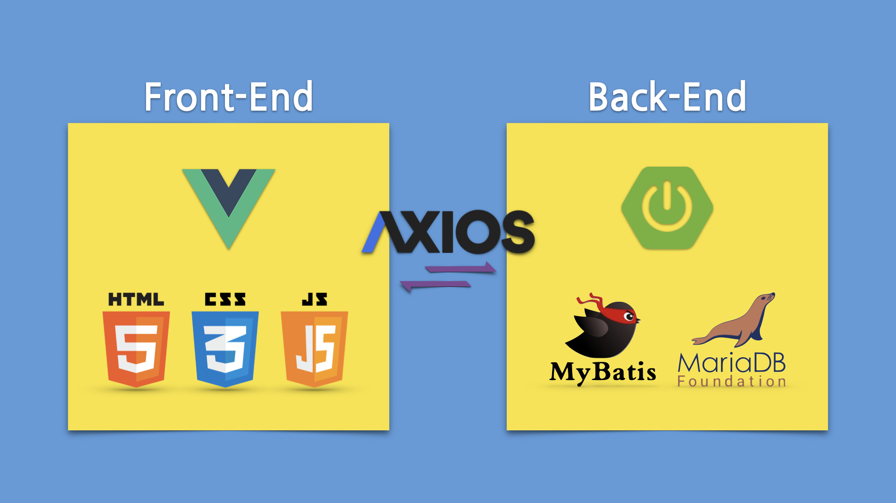

# Shell

Spring boot + Front-End Developer Folder

### 프로젝트 구조

##### Front-End > Vue3.\*

```
cd vue-app
yarn serve --port 8800 --open
```

##### Back-End > SpringBoot-3.0.5-SNAPSHOT

```
cd app
./gradlew bootRun
```

</img>

### YouTube Link

###### 1. 프로젝트 만들기

[](https://youtu.be/povDCmh3BfM)

###### 2. Vue화면 설정하기 (Router)

[](https://youtu.be/PACW_Wmafns)

###### 3. Axios 사용하기 [CROS Policy]

[](https://youtu.be/veDJeJe5Xck)

###### 4. SpringBoot 기능 구현하기 1부 [MVC패턴]

[](https://youtu.be/_OzpyzFd1d0)

###### 4. SpringBoot 기능 구현하기 2부 [MVC패턴]

[](https://youtu.be/-FSmrUACdpo)

###### 5. Vue 이벤트 1부 [ListView Event]

[](https://youtu.be/0EA3vWoszyM)

###### 6. Vue 이벤트 2부 [Vuex Store]

[](https://youtu.be/im-fzWGZilo)
